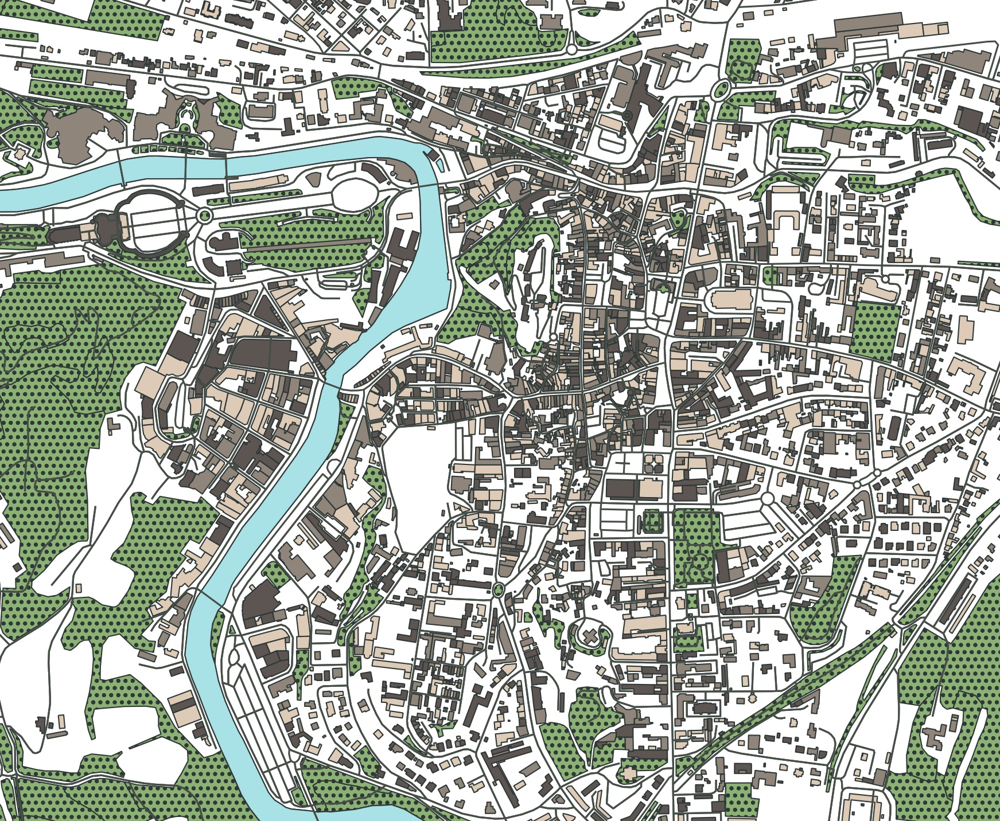

# OSM Map Plotting

A simple notebook which retrieves OpenStreetMap data and plots layers into a map.

## Setup

### Environment

Tested with Python 3.9. Use venv to set up a virtualenv:

```
python3 -m venv venv
. venv/bin/activate
```

### Installation

```
pip install -r requirements.txt
```

## Run

```
jupyter notebook osm-map-plotting.ipynb
```

## Example


